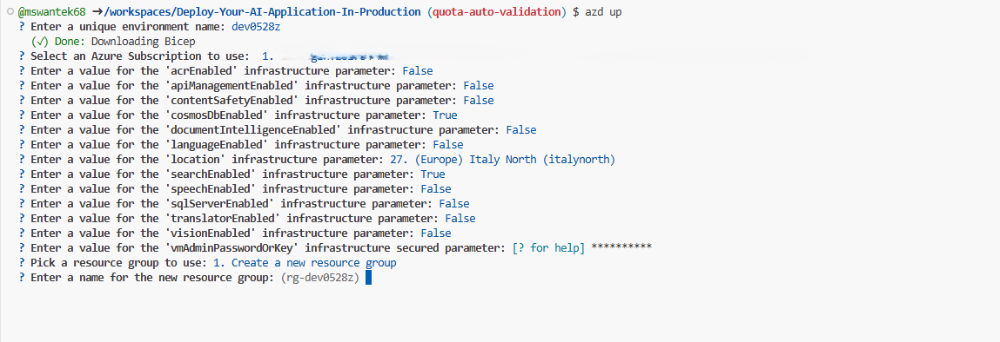
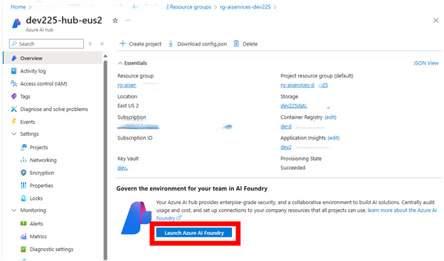

# Steps to Provision Network Isolated environment using GitHub Codespaces using AZD CLI

1. Navigate to the repo
2. Click the code button
3. Click the Codespaces tab
4. Click "Create Codespaces on main"

   

   This step will create the codespaces environment for you and launch a web based VS Code session.
5. In the terminal window (usually below by default) you can select the layout of the window in the upper right corner.

   

6. Log into your Azure subscription by leveraging the “azd auth login” command. Type the command “azd auth login”. It will display a code to copy and paste into the authorization window that will appear when you hit the enter button.

   

   

   

   **Prompting for MFA**

   

7. Return to the codespaces window now. In the terminal window, begin by initializing the environment by typing the command “azd init”

   

8. Enter the name for your environment

   

9. Now start the deployment of the infrastructure by typing the command “azd provision”

   

   This step will allow you to choose from the subscriptions you have available, based on the account you logged in with in the azd auth login step. Next it will prompt you for the region to deploy the resources into.

   

10. The provisioning of resources will run and deploy the Network Isolated AI Foundry Hub, Project and dependent resources in about 20 minutes.

# Post Deployment Steps:
These steps will help to check that the isolated environment was set up correctly.
Follow these steps to check the creation of the required private endpoints in the environment (when set to networkIsolation = true).

One way to check if the access is private to the hub is to launch the AI Foundry hub from the portal. 

When a user that is not connected through the virtual network via an RDP approved connection will see the following screen in their browser. This is the intended behavior! 

A more thourough check is to look for the networking settings and checking for private end points.

1. Go to the Azure Portal and select your Azure AI hub that was just created.

2.	Click on Settings and then Networking.

    

3.	Open the Workspace managed outbound access tab.

    

    Here, you will find the private endpoints that are connected to the resources within the hub managed virtual network. Ensure that these private endpoints are active.
    The hub should show that Public access is ‘disabled’.

## Connecting to the isolated network via RDP
1.	Navigate to the resource group where the isolated AI Foundry was deployed to and select the virtual machine.

    

2.	Be sure that the Virtual Machine is running. If not, start the VM.

    

3.	Select “Bastion” under the ‘Connect’ heading in the VM resource.

    

4.	Supply the username and the password you created as environment variables and press the connect button.

    

5.	Your virtual machine will launch and you will see a different screen.

    

6.	Launch Edge browser and navigate to your AI Foundry Hub. https://ai.azure.com Sign in using your credentials.

7.	You are challenged by MFA to connect.

    

8.	You will now be able to view the Foundry Hub which is contained in an isolated network.

    

## Contributing

This project welcomes contributions and suggestions. Most contributions require you to agree to a
Contributor License Agreement (CLA) declaring that you have the right to, and actually do, grant us
the rights to use your contribution. For details, visit https://cla.opensource.microsoft.com.

When you submit a pull request, a CLA bot will automatically determine whether you need to provide
a CLA and decorate the PR appropriately (e.g., status check, comment). Simply follow the instructions
provided by the bot. You will only need to do this once across all repos using our CLA.

This project has adopted the [Microsoft Open Source Code of Conduct](https://opensource.microsoft.com/codeofconduct/).
For more information see the [Code of Conduct FAQ](https://opensource.microsoft.com/codeofconduct/faq/) or
contact [opencode@microsoft.com](mailto:opencode@microsoft.com) with any additional questions or comments.

## Trademarks

This project may contain trademarks or logos for projects, products, or services. Authorized use of Microsoft 
trademarks or logos is subject to and must follow 
[Microsoft's Trademark & Brand Guidelines](https://www.microsoft.com/en-us/legal/intellectualproperty/trademarks/usage/general).
Use of Microsoft trademarks or logos in modified versions of this project must not cause confusion or imply Microsoft sponsorship.
Any use of third-party trademarks or logos are subject to those third-party's policies.
