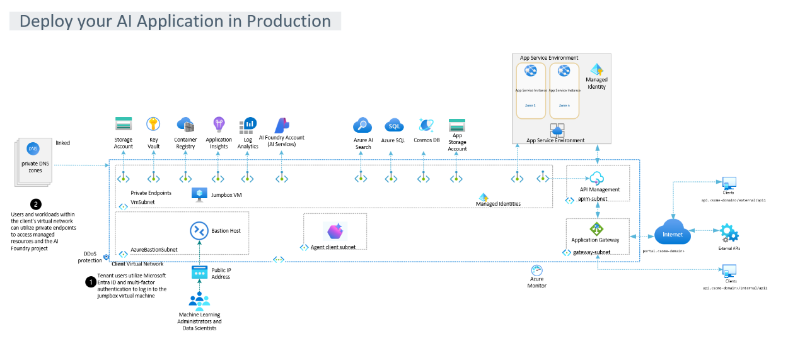

<!---------------------[  Description  ]------------------<recommended> section below------------------>

# Deploy your AI Application in Production

**Note:** With any AI solutions you create using these templates, you are responsible for assessing all associated risks and for complying with all applicable laws and safety standards. Learn more in the transparency documents for [Agent Service](https://learn.microsoft.com/en-us/azure/ai-foundry/responsible-ai/agents/transparency-note) and [Agent Framework](https://github.com/microsoft/agent-framework/blob/main/TRANSPARENCY_FAQ.md).

## Overview

🚀 **New: Updated deployment to match Foundry release at Build 2025!**
This new update has been tested in the EastUS2 region successfully.
This is a foundational solution for deploying an AI Foundry account ([Cognitive Services accountKind = 'AIServices'](https://review.learn.microsoft.com/en-us/azure/templates/microsoft.cognitiveservices/2025-04-01-preview/accounts?branch=main&pivots=deployment-language-bicep)) and project ([cognitiveServices/projects](https://review.learn.microsoft.com/en-us/azure/templates/microsoft.cognitiveservices/2025-04-01-preview/accounts/projects?branch=main&pivots=deployment-language-bicep)) into an isolated environment (vNet) within Azure. The deployed features follow Microsoft's Well-Architected Framework [WAF](https://learn.microsoft.com/en-us/azure/well-architected/) to establish an isolated infrastructure for AI Foundry, intended to assist in moving from a Proof of Concept state to a production-ready application. 

This template leverages Azure Verified Modules (AVM) and the Azure Developer CLI (AZD) to provision a WAF-aligned infrastructure for AI application development. This infrastructure includes AI Foundry elements, a virtual network (VNET), private endpoints, Key Vault, a storage account, and additional, optional WAF-aligned resources (such as AI Search, Cosmos DB and SQL Server) that can be leveraged with Foundry developed projects.

The following deployment automates our recommended configuration to protect your data and resources; using Microsoft Entra ID role-based access control, a managed network, and private endpoints. We recommend disabling public network access for Azure OpenAI resources, Azure AI Search resources, and storage accounts (which will occur when deploying those optional services within this workflow). Using selected networks with IP rules isn't supported because the services' IP addresses are dynamic.

This repository will automate:
1. Configuring the virtual network, private end points and private link services to isolate resources connecting to the account and project in a secure way. [Secure Data Playground](https://learn.microsoft.com/en-us/azure/ai-foundry/how-to/secure-data-playground)
2. Deploying and configuring the network isolation of the Azure AI Foundry account and project sub-resource within the virtual network, and with all services configured behind private end points. 

## Architecture
The diagram below illustrates the capabilities included in the template.

| Diagram Step      | Description     |
| ------------- | ------------- |
| 1 | Tenant users utilize Microsoft Entra ID and multi-factor authentication to log in to the jumpbox virtual machine |
| 2 | Users and workloads within the client's virtual network can utilize private endpoints to access managed resources and the hub workspace|
| 3 | The workspace-managed virtual network is automatically generated for you when you configure managed network isolation to one of the following modes:   Allow Internet Outbound   Allow Only Approved Outbound|
| 4 | The online endpoint is secured with Microsoft Entra ID authentication. Client applications must obtain a security token from the Microsoft Entra ID tenant before invoking the prompt flow hosted by the managed deployment and available through the online endpoint|
| 5 | API Management creates consistent, modern API gateways for existing backend services. In this architecture, API Management is used in a fully private mode to offload cross-cutting concerns from the API code and hosts.|

## Features

### What solutions does this enable? 
- Deploys an AI Foundry account and project leveraging the latest AI Foundry updates announced at Build 2025, into a virtual network with all dependent services connected via private end points. 

- Configures AI Foundry, adhering to the best practices outlined in the Well Architected Framework.

- Provides the ability to [add additional Azure services during deployment](docs/add_additional_services.md), configured to connect via isolation to enrich your AI project.
    (AI Search, API Management, CosmosDB, Azure SQL DB)

-  🚀 **New**: 
Offers ability to [start with an existing Azure AI Project](docs/transfer_project_connections.md) which will provision dependent Azure resources based on the Project's established connections within AI Foundry.

## Prerequisites and high-level steps

1. Have access to an Azure subscription and Entra ID account with Contributor permissions.
2. Confirm the subscription you are deploying into has the [Required Roles and Scopes](docs/Required_roles_scopes_resources.md).
3. The solution ensures secure access to the private VNET through a jump-box VM with Azure Bastion. By default, Bastion does not require an inbound NSG rule for network traffic. However, if your environment enforces specific policy rules, you can resolve access issues by entering your machine's IP address in the `allowedIpAddress` parameter when prompted during deployment. If not specified, all IP addresses are allowed to connect to Azure Bastion. 
4. If deploying from your [local environment](docs/local_environment_steps.md), install the [Azure CLI (AZ)](https://learn.microsoft.com/en-us/cli/azure/install-azure-cli?view=azure-cli-latest) and the [Azure Developer CLI (AZD)](https://learn.microsoft.com/en-us/azure/developer/azure-developer-cli/install-azd?tabs=winget-windows%2Cbrew-mac%2Cscript-linux&pivots=os-windows).
5. If deploying via [GitHub Codespaces](docs/github_code_spaces_steps.md) - requires the user to be on a GitHub Team or Enterprise Cloud plan.
6. If leveraging [GitHub Actions](docs/github_actions_steps.md).
7. Optionally [include a sample AI chat application](/docs/sample_app_setup.md) with the deployment.

### Check Azure OpenAI Quota Availability  

To ensure sufficient quota is available in your subscription, please follow **[quota check instructions guide](./docs/quota_check.md)** before deploying the solution.

### Services Enabled

For additional documentation of the default enabled services of this solution accelerator, please see:

1. [Azure Open AI Service](https://learn.microsoft.com/en-us/azure/ai-services/openai/)
2. [Azure AI Search](https://learn.microsoft.com/en-us/azure/search/)
3. [Azure AI hub](https://learn.microsoft.com/en-us/azure/ai-foundry/)
4. [Azure AI project](https://learn.microsoft.com/en-us/azure/ai-foundry/)
5. [Azure Container Registry](https://learn.microsoft.com/en-us/azure/container-registry/)
6. [Azure Virtual Machines](https://learn.microsoft.com/en-us/azure/virtual-machines/)
7. [Azure Storage](https://learn.microsoft.com/en-us/azure/storage/)
8. [Azure Virtual Network](https://learn.microsoft.com/en-us/azure/virtual-network/)
9. [Azure Key vault](https://learn.microsoft.com/en-us/azure/key-vault/)
10. [Azure Bastion](https://learn.microsoft.com/en-us/azure/bastion/)
11. [Azure Log Analytics](https://learn.microsoft.com/en-us/azure/azure-monitor/logs/log-analytics-overview)
12. [Azure Application Insights](https://learn.microsoft.com/en-us/azure/azure-monitor/app/app-insights-overview)

## Getting Started

<h2>
 
QUICK DEPLOY
</h2>

|  |  | [&message=Open&color=blue&logo=visualstudiocode&logoColor=white)](https://insiders.vscode.dev/azure/?vscode-azure-exp=foundry&agentPayload=eyJiYXNlVXJsIjogImh0dHBzOi8vcmF3LmdpdGh1YnVzZXJjb250ZW50LmNvbS9IYXJzaC1NaWNyb3NvZnQvRGVwbG95LVlvdXItQUktQXBwbGljYXRpb24tSW4tUHJvZHVjdGlvbi9yZWZzL2hlYWRzL2hiLXBzbC12c2NvZGV3ZWIvaW5mcmEvdnNjb2RlX3dlYiIsICJpbmRleFVybCI6ICIvaW5kZXguanNvbiIsICJ2YXJpYWJsZXMiOiB7ImFnZW50SWQiOiAiIiwgImNvbm5lY3Rpb25TdHJpbmciOiAiIiwgInRocmVhZElkIjogIiIsICJ1c2VyTWVzc2FnZSI6ICIiLCAicGxheWdyb3VuZE5hbWUiOiAiIiwgImxvY2F0aW9uIjogIiIsICJzdWJzY3JpcHRpb25JZCI6ICIiLCAicmVzb3VyY2VJZCI6ICIiLCAicHJvamVjdFJlc291cmNlSWQiOiAiIiwgImVuZHBvaW50IjogIiJ9LCAiY29kZVJvdXRlIjogWyJhaS1wcm9qZWN0cy1zZGsiLCAicHl0aG9uIiwgImRlZmF1bHQtYXp1cmUtYXV0aCIsICJlbmRwb2ludCJdfQ==) |
|---|---|---|
[Steps to deploy with GitHub Codespaces](docs/github_code_spaces_steps.md)| [Steps to deploy with Dev Container](docs/Dev_ContainerSteps.md) |

## Connect to and validate access to the new environment 
Follow the post deployment steps [Post Deployment Steps](docs/github_code_spaces_steps.md) to connect to the isolated environment.

## Deploy Sample Application with the new environment
Optionally include a [sample AI chat application](/docs/sample_app_setup.md) to showcase a production AI application deployed to a secure environment.

## Deploy your application in the isolated environment
- Leverage the Microsoft Learn documentation to provision an app service instance within your secure network [Configure Web App](https://learn.microsoft.com/en-us/azure/ai-services/openai/how-to/on-your-data-configuration#azure-ai-foundry-portal)
- Follow these instructions to [Add your data and chat with it in the AI Foundry playground](https://learn.microsoft.com/en-us/azure/ai-foundry/tutorials/deploy-chat-web-app#add-your-data-and-try-the-chat-model-again)

## Guidance

### Region Availability

By default, this template uses AI models which may not be available in all Azure regions. Please follow [quota check instructions guide](./docs/quota_check.md) before deploying the solution. Additionally, check for [up-to-date region availability](https://learn.microsoft.com/azure/ai-services/openai/concepts/models#standard-deployment-model-availability) and select a region during deployment accordingly.

### Costs

You can estimate the cost of this project's architecture with [Azure's pricing calculator](https://azure.microsoft.com/pricing/calculator/)

### Security Guidelines

This template leverages [Managed Identity](https://learn.microsoft.com/entra/identity/managed-identities-azure-resources/overview) between services to eliminate the need for developers to manage these credentials. Applications can use managed identities to obtain Microsoft Entra tokens without having to manage any credentials.

To ensure continued best practices in your own repository, we recommend that anyone creating solutions based on our templates ensure that the [Github secret scanning](https://docs.github.com/code-security/secret-scanning/about-secret-scanning) setting is enabled.

You may want to consider additional security measures, such as:
- Enabling Microsoft Defender for Cloud to [secure your Azure resources](https://learn.microsoft.com/azure/defender-for-cloud/),
>#### Important Security Notice
>This template, the application code and configuration it contains, has been built to showcase >Microsoft Azure specific services and tools. We strongly advise our customers not to make this code part of their production environments without implementing or enabling additional security features.
>
>For a more comprehensive list of best practices and security recommendations for Intelligent Applications, [visit our official documentation](https://learn.microsoft.com/en-us/azure/ai-foundry/).

## Resources

- [Azure AI Foundry documentation](https://learn.microsoft.com/en-us/azure/ai-foundry/)
- [Azure Well Architecture Framework documentation](https://learn.microsoft.com/en-us/azure/well-architected/)
- [Azure OpenAI Service - Documentation, quickstarts, API reference - Azure AI services | Microsoft Learn](https://learn.microsoft.com/en-us/azure/ai-services/openai/concepts/use-your-data)
- [Azure AI Content Understanding documentation](https://learn.microsoft.com/en-us/azure/ai-services/content-understanding/)
---

## Disclaimers

To the extent that the Software includes components or code used in or derived from Microsoft products or services, including without limitation Microsoft Azure Services (collectively, “Microsoft Products and Services”), you must also comply with the Product Terms applicable to such Microsoft Products and Services. You acknowledge and agree that the license governing the Software does not grant you a license or other right to use Microsoft Products and Services. Nothing in the license or this ReadMe file will serve to supersede, amend, terminate or modify any terms in the Product Terms for any Microsoft Products and Services. 

You must also comply with all domestic and international export laws and regulations that apply to the Software, which include restrictions on destinations, end users, and end use. For further information on export restrictions, visit https://aka.ms/exporting. 

You acknowledge that the Software and Microsoft Products and Services (1) are not designed, intended or made available as a medical device(s), and (2) are not designed or intended to be a substitute for professional medical advice, diagnosis, treatment, or judgment and should not be used to replace or as a substitute for professional medical advice, diagnosis, treatment, or judgment. Customer is solely responsible for displaying and/or obtaining appropriate consents, warnings, disclaimers, and acknowledgements to end users of Customer’s implementation of the Online Services. 

You acknowledge the Software is not subject to SOC 1 and SOC 2 compliance audits. No Microsoft technology, nor any of its component technologies, including the Software, is intended or made available as a substitute for the professional advice, opinion, or judgement of a certified financial services professional. Do not use the Software to replace, substitute, or provide professional financial advice or judgment.  

BY ACCESSING OR USING THE SOFTWARE, YOU ACKNOWLEDGE THAT THE SOFTWARE IS NOT DESIGNED OR INTENDED TO SUPPORT ANY USE IN WHICH A SERVICE INTERRUPTION, DEFECT, ERROR, OR OTHER FAILURE OF THE SOFTWARE COULD RESULT IN THE DEATH OR SERIOUS BODILY INJURY OF ANY PERSON OR IN PHYSICAL OR ENVIRONMENTAL DAMAGE (COLLECTIVELY, “HIGH-RISK USE”), AND THAT YOU WILL ENSURE THAT, IN THE EVENT OF ANY INTERRUPTION, DEFECT, ERROR, OR OTHER FAILURE OF THE SOFTWARE, THE SAFETY OF PEOPLE, PROPERTY, AND THE ENVIRONMENT ARE NOT REDUCED BELOW A LEVEL THAT IS REASONABLY, APPROPRIATE, AND LEGAL, WHETHER IN GENERAL OR IN A SPECIFIC INDUSTRY. BY ACCESSING THE SOFTWARE, YOU FURTHER ACKNOWLEDGE THAT YOUR HIGH-RISK USE OF THE SOFTWARE IS AT YOUR OWN RISK.  

* Data Collection. The software may collect information about you and your use of the software and send it to Microsoft. Microsoft may use this information to provide services and improve our products and services. You may turn off the telemetry as described in the repository. There are also some features in the software that may enable you and Microsoft to collect data from users of your applications. If you use these features, you must comply with applicable law, including providing appropriate notices to users of your applications together with a copy of Microsoft’s privacy statement. Our privacy statement is located at https://go.microsoft.com/fwlink/?LinkID=824704. You can learn more about data collection and use in the help documentation and our privacy statement. Your use of the software operates as your consent to these practices.
