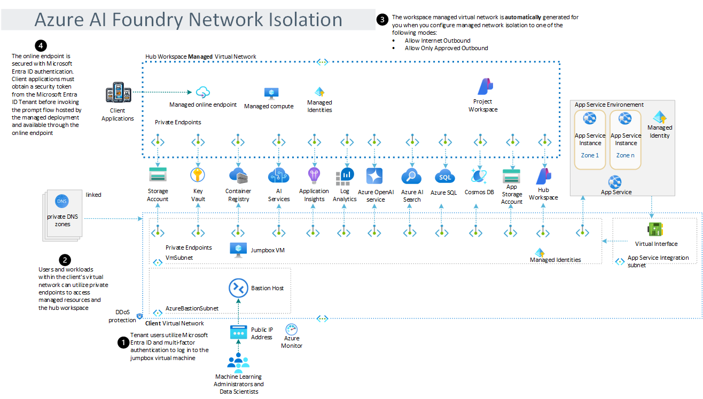

<!--=========================README TEMPLATE INSTRUCTIONS=============================
======================================================================================

- THIS README TEMPLATE LARGELY CONSISTS OF COMMENTED OUT TEXT. THIS UNRENDERED TEXT IS MEANT TO BE LEFT IN AS A GUIDE 
  THROUGHOUT THE REPOSITORY'S LIFE WHILE END USERS ONLY SEE THE RENDERED PAGE CONTENT. 
- Any italicized text rendered in the initial template is intended to be replaced IMMEDIATELY upon repository creation.

- This template is default but not mandatory. It was designed to compensate for typical gaps in Microsoft READMEs 
  that slow the pace of work. You may delete it if you have a fully populated README to replace it with.

- Most README sections below are commented out as they are not known early in a repository's life. Others are commented 
  out as they do not apply to every repository. If a section will be appropriate later but not known now, consider 
  leaving it in commented out and adding an issue as a reminder.
- There are additional optional README sections in the external instruction link below. These include; "citation",  
  "built with", "acknowledgments", "folder structure", etc.
- You can easily find the places to add content that will be rendered to the end user by searching 
within the file for "TODO".


- ADDITIONAL EXTERNAL TEMPLATE INSTRUCTIONS:
  -  https://aka.ms/StartRight/README-Template/Instructions

======================================================================================
====================================================================================-->


<!---------------------[  Description  ]------------------<recommended> section below------------------>

# Deploy your AI Application in Production

## Overview

This solution accelerator providates a foundation template for deploying a Project within AI Foundry into a secure, private, and protected landing zone within Azure. This zone will be established under Microsoft's Well-Architected Framework (WAF) to provide secure infrastructure for an AI Foundry Project intended to move from a Proof of Concept state to a production-ready application.

This template leverages Azure Verified Modules (AVM) and the Azure Developer CLI (AZD) to provision WAF-aligned infrastructure. This infrastructure includes AI Foundry elements, VNET, Private Endpoints, Key Vault, Storage Account and optional WAF-aligned resources such as Cosmos DB and SQL Server to leverage with AI Foundry developed Projects.

## Architecture



## Key Features
### What solutions does this enable? 
- Deploy AI Foundry application into a secure environment 

- Connect application to essential Azure services while adhering to the best practices outlined in the Well Architected Framework

- Provide the ability to select services to deploy relevant to the project  
  
## Prerequisites

1. Azure Subscription and Entra ID Account with approprite Contributor permissions.

# Setup

## Prepare the template
### Clone Repository

```bash
git clone https://github.com/mcaps-microsoft/Foundry-Deployment-Template.git
cd Foundry-Deployment-Template
```

### Check Local Environment Dependencies

Run the CheckLocalDependencies.ps1 script to ensure the latest CLIs and dependencies are installed. If any dependencies are missing, the script will output guidance on how to install.

```powershell
cd scripts
.\CheckLocalDependencies.ps1
```
## Provision network isolated environment
### Establish AZD Environment

This solution uses the [Azure Developer CLI](https://learn.microsoft.com/en-us/azure/developer/azure-developer-cli/overview) to quickly provision and deploy infrastructure and applications to Azure.

To get started, authenticate with an Azure Subscription ([details](https://learn.microsoft.com/en-us/azure/developer/azure-developer-cli/reference#azd-auth-login)):

```powershell
azd auth login
```

Establish new environment. Provide a name that represents the application domain:

```powershell
azd env new '<app name>' --subscription '<azure subscription id>' --location '<azure region>'
```

Establish required environment variables:

```powershell
azd env set 'AZURE_VM_ADMIN_USERNAME' '<username>'
azd env set 'AZURE_VM_ADMIN_PASSWORD' '<secure password>'
```

### Deploy

To provision the necessary Azure resoruces and deploy the application, run the UP command:

```powershell
azd up
```
Select a subscription from your Azure account, and select a location which has quota for all the resources.

- This deployment will take 15-20 minutes to provision the resources in your account
- If you get an error or timeout with deployment, changing the location can help, as there may be availability constraints for the resources.
  
## Connect to & Check new environment
1. Use Azure portal to verify that Azure services are deployed.
```powershell
Is there a code option to help with this?
```   
2. Use Azure Bastion to access the network isolated AI Foundry hub & project
<!-- Is there a link we can add? -->

## Connect your model 
<!-- Add latest guidance in customer friendly language -->
Lorem ipsum dolor sit amet, consectetur adipiscing elit. Sed do eiusmod tempor incididunt ut labore et dolore magna aliqua.## Deploy your application in hardened environment
Provision additional production resources (data, storage, services) and configure secure access. 

## Deploy your application in hardened environment
Provision additional production resources (data, storage, services) and configure secure access. 

<h2>
Supporting documents
</h2>

### Additional resources

- [Microsoft Fabric documentation - Microsoft Fabric | Microsoft Learn](https://learn.microsoft.com/en-us/fabric/)
- [Azure OpenAI Service - Documentation, quickstarts, API reference - Azure AI services | Microsoft Learn](https://learn.microsoft.com/en-us/azure/ai-services/openai/concepts/use-your-data)
- [Azure AI Content Understanding documentation](https://learn.microsoft.com/en-us/azure/ai-services/content-understanding/)
- [Azure AI Foundry documentation](https://learn.microsoft.com/en-us/azure/ai-studio/)

<!-- </br>
Responsible AI Transparency FAQ 
</h2> 

Please refer to [Transparency FAQ](./TRANSPARENCY_FAQ.md) for responsible AI transparency details of this solution accelerator. -->

<br/>
<br/>
<br/>

---

## Disclaimers

To the extent that the Software includes components or code used in or derived from Microsoft products or services, including without limitation Microsoft Azure Services (collectively, “Microsoft Products and Services”), you must also comply with the Product Terms applicable to such Microsoft Products and Services. You acknowledge and agree that the license governing the Software does not grant you a license or other right to use Microsoft Products and Services. Nothing in the license or this ReadMe file will serve to supersede, amend, terminate or modify any terms in the Product Terms for any Microsoft Products and Services. 

You must also comply with all domestic and international export laws and regulations that apply to the Software, which include restrictions on destinations, end users, and end use. For further information on export restrictions, visit https://aka.ms/exporting. 

You acknowledge that the Software and Microsoft Products and Services (1) are not designed, intended or made available as a medical device(s), and (2) are not designed or intended to be a substitute for professional medical advice, diagnosis, treatment, or judgment and should not be used to replace or as a substitute for professional medical advice, diagnosis, treatment, or judgment. Customer is solely responsible for displaying and/or obtaining appropriate consents, warnings, disclaimers, and acknowledgements to end users of Customer’s implementation of the Online Services. 

You acknowledge the Software is not subject to SOC 1 and SOC 2 compliance audits. No Microsoft technology, nor any of its component technologies, including the Software, is intended or made available as a substitute for the professional advice, opinion, or judgement of a certified financial services professional. Do not use the Software to replace, substitute, or provide professional financial advice or judgment.  

BY ACCESSING OR USING THE SOFTWARE, YOU ACKNOWLEDGE THAT THE SOFTWARE IS NOT DESIGNED OR INTENDED TO SUPPORT ANY USE IN WHICH A SERVICE INTERRUPTION, DEFECT, ERROR, OR OTHER FAILURE OF THE SOFTWARE COULD RESULT IN THE DEATH OR SERIOUS BODILY INJURY OF ANY PERSON OR IN PHYSICAL OR ENVIRONMENTAL DAMAGE (COLLECTIVELY, “HIGH-RISK USE”), AND THAT YOU WILL ENSURE THAT, IN THE EVENT OF ANY INTERRUPTION, DEFECT, ERROR, OR OTHER FAILURE OF THE SOFTWARE, THE SAFETY OF PEOPLE, PROPERTY, AND THE ENVIRONMENT ARE NOT REDUCED BELOW A LEVEL THAT IS REASONABLY, APPROPRIATE, AND LEGAL, WHETHER IN GENERAL OR IN A SPECIFIC INDUSTRY. BY ACCESSING THE SOFTWARE, YOU FURTHER ACKNOWLEDGE THAT YOUR HIGH-RISK USE OF THE SOFTWARE IS AT YOUR OWN RISK.  
