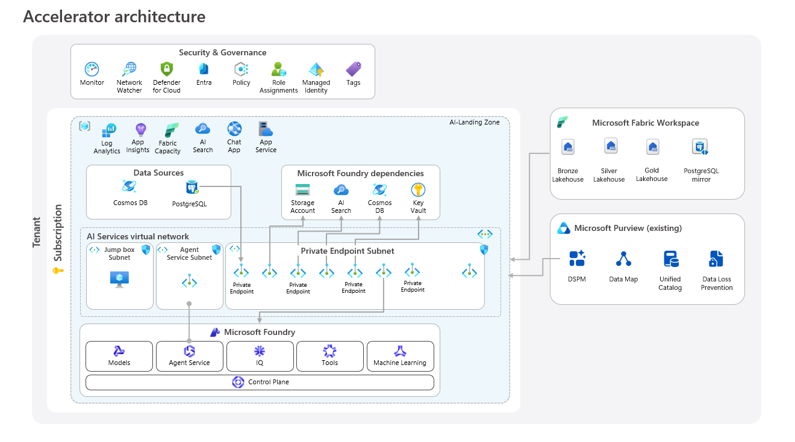

# Deploy Your AI Application In Production

Stand up a complete, production-ready AI application environment in Azure with a single command. This solution accelerator provisions Microsoft Foundry, Microsoft Fabric, Azure AI Search, and connects to your tenant level Microsoft Purview (when resourceId is provided) —all pre-wired with private networking, managed identities, and governance controls—so you can move from proof-of-concept to production in hours instead of weeks.

<br/>

<div align="center">
  
[**START HERE**](#start-here) \| [**SOLUTION OVERVIEW**](#solution-overview) \| [**BUSINESS SCENARIO**](#business-scenario) \| [**SUPPORTING DOCUMENTATION**](#supporting-documentation)

</div>


<!-------------------------------------------->
<!-- START HERE                              -->
<!-------------------------------------------->
<h2>
Start Here
</h2>

### Use This Accelerator When

This accelerator is a good fit if you want an end to end AI and Data platform built from the AI Landing Zone, in one deployment:

1. Microsoft Foundry
2. Azure AI Search and OneLake index
3. Microsoft Fabric workspace and lakehouses
4. Optional Microsoft Purview integration
5. Private networking and production-style Azure controls

If you only want a small Foundry demo or a basic RAG sample, this repo is heavier than you need.

### Required Deployment Steps

1. Start from an environment with `azd`, `az`, and `pwsh` available
2. Authenticate with Azure and select the target subscription and region
3. Initialize git submodules if you are not using Codespaces or Dev Containers
4. Review `infra/main.bicepparam` and decide whether Fabric and Purview are enabled for the first run
5. Check Azure OpenAI quota in the target region
6. Run `azd up`
7. Validate the deployment in [docs/post_deployment_steps.md](./docs/post_deployment_steps.md)

For the first attempt, the lowest-risk path is to keep Fabric and Purview disabled unless you already have their prerequisites in place.

> **Important:** The checked-in values in `infra/main.bicepparam` are an opinionated end-to-end provisioning path for this accelerator, not a neutral baseline for every scenario. They are useful for demonstrating the full stack and the automation flow, but they might enable services, networking, mirroring behavior, or governance hooks that you do not want in your target deployment.
>
> Before running `azd up`, review the active settings across:
> - repo wrapper parameters in `infra/main.bicepparam`
> - AI Landing Zone feature flags and topology implied by the preprovision deployment
> - postprovision automation expectations in `azure.yaml`
> - supporting server-specific settings such as PostgreSQL networking, mirroring mode, and Fabric/Purview inputs
>
> Treat the current defaults as the repo's "golden path" for a broad end-to-end demo and validation flow. Adjust them deliberately if you want a smaller, cheaper, or less integrated deployment.

> **Security note (PostgreSQL mirroring):** The mirroring prep script must run from a VNet-connected host when Key Vault and PostgreSQL are private. If you need a non-VNet demo, temporarily open access to both Key Vault and PostgreSQL, run the script, then lock them down. See [docs/post_deployment_steps.md](./docs/post_deployment_steps.md) for the manual steps, including the temporary Key Vault override.

### Dependency Map

| Area | Required to enable it | If missing |
|------|------------------------|------------|
| Base deployment | Azure subscription permissions, `az`, `azd`, `pwsh`, Azure sign-in, initialized submodules, Azure OpenAI quota | `azd up` fails before or during provisioning |
| Fabric automation | Fabric Administrator permissions or an existing Fabric setup, plus valid Fabric parameter values | Postprovision Fabric steps fail |
| Fabric capacity creation | At least one valid `fabricCapacityAdmins` entry when `fabricCapacityPreset='create'` | Capacity creation fails |
| Purview integration | Existing Purview account resource ID in the target tenant and subscription | Purview steps fail |
| PostgreSQL mirroring | PostgreSQL enabled in the deployment with `postgreSqlNetworkIsolation = false`, then follow the post-deploy mirror steps | Database deploys, but mirroring is not completed |
| Private networking | `networkIsolation = true` and enough deployment time for private endpoint provisioning | Deployment takes longer and is harder to troubleshoot if other prerequisites are not already stable |

### Choose Your Starting Path

| Goal | Recommended path |
|------|------------------|
| Fastest realistic validation | Local `azd up` workflow |
| Clean environment with fewer local setup issues | GitHub Codespaces |
| Deep customization before deploy | Read [docs/parameter_guide.md](./docs/parameter_guide.md) first |
| Lowest-risk first run | Disable Fabric and Purview, then re-enable later |

### How to Install or Deploy

Follow the deployment guide to deploy this solution to your own Azure subscription.

> **Note:** This solution accelerator requires **Azure Developer CLI (azd) version 1.15.0 or higher**. [Download azd here](https://learn.microsoft.com/en-us/azure/developer/azure-developer-cli/install-azd).

[**📘 Click here to launch the Deployment Guide**](./docs/deploymentguide.md)

<br/>

| [](https://codespaces.new/microsoft/Deploy-Your-AI-Application-In-Production) | [](https://vscode.dev/redirect?url=vscode://ms-vscode-remote.remote-containers/cloneInVolume?url=https://github.com/microsoft/Deploy-Your-AI-Application-In-Production) |
|---|---|

<br/>

> **Important: This repository uses git submodules**
> <br/>Clone with submodules included:
> ```bash
> git clone --recurse-submodules https://github.com/microsoft/Deploy-Your-AI-Application-In-Production.git
> ```
> If you already cloned without submodules, run:
> ```bash
> git submodule update --init --recursive
> ```
> **GitHub Codespaces and Dev Containers handle this automatically.**

> **Shell requirement**
> <br/>The repo uses `azd` as the main deployment interface. The preprovision and postprovision hooks run with PowerShell (`pwsh`), so your environment must be able to invoke `pwsh`.

> **Important: Check Azure OpenAI quota availability**
> <br/>To ensure sufficient quota is available in your subscription, please follow the [quota check instructions guide](./docs/quota_check.md) before deploying.

### First Deployment Checklist

1. Run `azd auth login` and confirm the target subscription with `az account show`
2. Create a new environment and set `AZURE_SUBSCRIPTION_ID` and `AZURE_LOCATION`
3. Review `infra/main.bicepparam`, especially `principalId`, `aiSearchAdditionalAccessObjectIds`, `fabricCapacityPreset`, `fabricWorkspacePreset`, `fabricCapacityAdmins`, `purviewAccountResourceId`, `networkIsolation`, `postgreSqlNetworkIsolation`, and `postgreSqlAllowAzureServices`
4. Run `azd up`
5. Follow [docs/post_deployment_steps.md](./docs/post_deployment_steps.md) to verify the deployment

> **Note:** Mirroring automation in the current branch is set for PostgreSQL deployments where `postgreSqlNetworkIsolation = false`. If you want PostgreSQL fully isolated, keep the private networking path and plan on the Fabric VNet gateway route for end-to-end mirroring.

### Prerequisites & Costs

<details open>
  <summary><b>Click to see prerequisites</b></summary>

  | Requirement | Details |
  |-------------|---------|
  | **Azure Subscription** | Owner or Contributor + User Access Administrator permissions |
  | **Microsoft Fabric** | Optional. Either access to create capacity/workspace, or provide existing Fabric capacity/workspace IDs, or disable Fabric automation |
  | **Microsoft Purview** | Existing tenant-level Purview account (or ability to create one) |
  | **Azure CLI** | Version 2.61.0 or later |
  | **Azure Developer CLI** | Version 1.15.0 or later |
  | **Quota** | Sufficient Azure OpenAI quota ([check here](./docs/quota_check.md)) |

  > **Note:** Fabric automation is optional. To disable all Fabric automation, set `fabricCapacityPreset = 'none'` and `fabricWorkspacePreset = 'none'` in `infra/main.bicepparam`.

  > **Note:** If you enable Fabric capacity deployment (`fabricCapacityPreset='create'`), you must supply at least one valid Fabric capacity admin principal (Entra user UPN email or object ID) via `fabricCapacityAdmins`.

  > **Note:** If you enable Fabric provisioning (`fabricWorkspacePreset='create'`), the user running `azd` must have the **Fabric Administrator** role (or equivalent Fabric/Power BI tenant admin permissions) to call the required admin APIs.

</details>

<details>
  <summary><b>Click to see estimated costs</b></summary>

  | Service | SKU | Estimated Monthly Cost |
  |---------|-----|------------------------|
  | Microsoft Foundry | Standard | [Pricing](https://azure.microsoft.com/pricing/details/machine-learning/) |
  | Azure OpenAI | Pay-per-token | [Pricing](https://azure.microsoft.com/pricing/details/cognitive-services/openai-service/) |
  | Azure AI Search | Standard | [Pricing](https://azure.microsoft.com/pricing/details/search/) |
  | Microsoft Fabric | F8 Capacity (if enabled) | [Pricing](https://azure.microsoft.com/pricing/details/microsoft-fabric/) |
  | Virtual Network + Bastion | Standard | [Pricing](https://azure.microsoft.com/pricing/details/azure-bastion/) |

  > **Cost Optimization:** Fabric capacity can be paused when not in use. Use `az fabric capacity suspend` to stop billing.

  Use the [Azure Pricing Calculator](https://azure.microsoft.com/pricing/calculator/) for detailed estimates.

</details>

<br/>

<!------------------------------------------>
<!-- SOLUTION OVERVIEW                       -->
<!------------------------------------------>
<h2>
Solution Overview
</h2>

This accelerator extends the [AI Landing Zone](https://github.com/Azure/ai-landing-zone) reference architecture to deliver an enterprise-scale, production-ready foundation for deploying secure AI applications and agents in Azure. It packages Microsoft's Well-Architected Framework principles around networking, identity, and operations from day zero.

### Solution Architecture

|  |
|---|

### Key Components

| Component | Purpose |
|-----------|---------|
| **Microsoft Foundry** | Unified platform for AI development, testing, and deployment with playground, prompt flow, and publishing |
| **Microsoft Fabric** | Data foundation with lakehouses (bronze/silver/gold) for document storage and OneLake indexing |
| **Azure Database for PostgreSQL** | Optional operational data source that can be prepared for Microsoft Fabric mirroring, including automated Fabric connection creation or reuse after deployment |
| **Azure AI Search** | Retrieval backbone enabling RAG (Retrieval-Augmented Generation) chat experiences |
| **Microsoft Purview** | Governance layer for cataloging, scans, and Data Security Posture Management |
| **Private Networking** | All traffic secured via private endpoints—no public internet exposure |

<br/>

### Additional Resources

- [AI Landing Zone Documentation](https://github.com/Azure/bicep-ptn-aiml-landing-zone)
- [Microsoft Foundry documentation](https://learn.microsoft.com/en-us/azure/ai-foundry/)
- [Microsoft Fabric Documentation](https://learn.microsoft.com/en-us/fabric/)

### Key Features

<details open>
  <summary>Click to learn more about the key features this solution enables</summary>

  - **Single-command deployment** <br/>
  Run `azd up` to provision 30+ Azure resources in ~45 minutes with pre-wired security controls.

  - **Production-grade security from day zero** <br/>
  Private endpoints, managed identities, and RBAC enabled by default—no public internet exposure.

  - **Integrated data-to-AI pipeline** <br/>
  Connect Fabric lakehouses → OneLake indexer → AI Search → Foundry playground for grounded chat experiences.

  - **PostgreSQL-to-Fabric mirroring path** <br/>
  Provision Azure Database for PostgreSQL, prepare it for Fabric mirroring, automatically create or reuse the Fabric connection, and mirror operational data into OneLake for downstream analytics and AI scenarios.

  - **Governance built-in** <br/>
  Microsoft Purview integration for cataloging, scoped scans, and Data Security Posture Management (DSPM).

  - **Extensible AVM-driven platform** <br/>
  Toggle additional Azure services through AI Landing Zone parameters for broader intelligent app scenarios.

</details>

<br/>

<!------------------------------------------>
<!-- BUSINESS SCENARIO                       -->
<!------------------------------------------>
<h2>
Business Scenario
</h2>

### What You Get

After deployment, you'll have a complete, enterprise-ready platform that unifies AI development, data management, and governance:

| Layer | What's Deployed | Why It Matters |
|-------|-----------------|----------------|
| **AI Platform** | Microsoft Foundry with OpenAI models, playground, and prompt flow | Build, test, and publish AI chat applications without managing infrastructure |
| **Data Foundation** | Microsoft Fabric with bronze/silver/gold lakehouses and OneLake indexing | Store documents at scale and automatically feed them into your AI workflows |
| **Operational Data Mirroring** | Azure Database for PostgreSQL prepared for Fabric mirroring | Bring PostgreSQL operational data into Fabric with an automated connection-and-mirror flow plus documented fallback steps |
| **Search & Retrieval** | Azure AI Search with vector and semantic search | Enable RAG (Retrieval-Augmented Generation) for grounded, accurate AI responses |
| **Governance** | Microsoft Purview with cataloging, scans, and DSPM | Track data lineage, enforce policies, and maintain compliance visibility |
| **Security** | Private endpoints, managed identities, RBAC, network isolation | Zero public internet exposure—all traffic stays on the Microsoft backbone |

<br/>

### Sample Workflow

1. **Deploy infrastructure** → Run `azd up` to provision all resources (~45 minutes)
2. **Upload documents** → Add PDFs to the Fabric bronze lakehouse
3. **Index content** → OneLake indexer automatically populates AI Search
4. **Test in playground** → Connect Foundry to the search index and chat with your data
5. **Publish application** → Deploy the chat experience to end users
6. **Monitor governance** → Review data lineage and security posture in Purview

### PostgreSQL Post-Provision Steps

If you deploy Azure Database for PostgreSQL, use these docs after deployment:

1. [docs/postgresql_mirroring.md](./docs/postgresql_mirroring.md)
2. [docs/post_deployment_steps.md](./docs/post_deployment_steps.md)

If the post-provision mirroring automation cannot complete, start with the **Minimal Manual Fallback** section in [docs/postgresql_mirroring.md](./docs/postgresql_mirroring.md). It calls out the shortest path for both public-access and private-network deployments.

<br/>

<!------------------------------------------>
<!-- SUPPORTING DOCUMENTATION                -->
<!------------------------------------------>
<h2>
Supporting documentation
</h2>

### Deployment & Configuration

| Document | Description |
|----------|-------------|
| [Deployment Guide](./docs/deploymentguide.md) | Complete deployment instructions |
| [Post Deployment Steps](./docs/post_deployment_steps.md) | Verify your deployment |
| [PostgreSQL Mirroring](./docs/postgresql_mirroring.md) | Automate or troubleshoot the Fabric connection and PostgreSQL mirror flow |
| [Parameter Guide](./docs/parameter_guide.md) | Configure deployment parameters |
| [Quota Check Guide](./docs/quota_check.md) | Check Azure OpenAI quota availability |

### Customization & Operations

| Document | Description |
|----------|-------------|
| [Required Roles & Scopes](./docs/required_roles_scopes_resources.md) | IAM requirements for deployment |
| [Parameter Guide](./docs/parameter_guide.md) | All deployment parameters, toggles & model configs |
| [Deploy App from Foundry](./docs/deploy_app_from_foundry.md) | Publish playground to App Service |
| [Accessing Private Resources](./docs/ACCESSING_PRIVATE_RESOURCES.md) | Connect via Jump VM |

### Security Guidelines

<details>
  <summary><b>Click to see security best practices</b></summary>

  This template leverages [Managed Identity](https://learn.microsoft.com/entra/identity/managed-identities-azure-resources/overview) between services to eliminate credential management.

  **Recommendations:**
  - Enable [GitHub secret scanning](https://docs.github.com/code-security/secret-scanning/about-secret-scanning) on your repository
  - Consider enabling [Microsoft Defender for Cloud](https://learn.microsoft.com/azure/defender-for-cloud/)
  - Review the [Microsoft Foundry security documentation](https://learn.microsoft.com/en-us/azure/ai-foundry/)

  > ⚠️ **Important:** This template is built to showcase Azure services. Implement additional security measures before production use.

</details>

<br/>

<!-------------------------------------------->
<!-- FEEDBACK & FAQ                          -->
<!-------------------------------------------->
## Provide Feedback

Have questions, found a bug, or want to request a feature? [Submit a new issue](https://github.com/microsoft/Deploy-Your-AI-Application-In-Production/issues) and we'll connect.

<br/>

## Responsible AI Transparency FAQ

Please refer to [Transparency FAQ](./docs/transparency_faq.md) for responsible AI transparency details of this solution accelerator.

<br/>

<!-------------------------------------------->
<!-- DISCLAIMERS                             -->
<!-------------------------------------------->
## Disclaimers

<details>
  <summary><b>Click to see full disclaimers</b></summary>

To the extent that the Software includes components or code used in or derived from Microsoft products or services, including without limitation Microsoft Azure Services (collectively, "Microsoft Products and Services"), you must also comply with the Product Terms applicable to such Microsoft Products and Services. You acknowledge and agree that the license governing the Software does not grant you a license or other right to use Microsoft Products and Services. Nothing in the license or this ReadMe file will serve to supersede, amend, terminate or modify any terms in the Product Terms for any Microsoft Products and Services.

You must also comply with all domestic and international export laws and regulations that apply to the Software, which include restrictions on destinations, end users, and end use. For further information on export restrictions, visit https://aka.ms/exporting.

You acknowledge that the Software and Microsoft Products and Services (1) are not designed, intended or made available as a medical device(s), and (2) are not designed or intended to be a substitute for professional medical advice, diagnosis, treatment, or judgment and should not be used to replace or as a substitute for professional medical advice, diagnosis, treatment, or judgment. Customer is solely responsible for displaying and/or obtaining appropriate consents, warnings, disclaimers, and acknowledgements to end users of Customer's implementation of the Online Services.

You acknowledge the Software is not subject to SOC 1 and SOC 2 compliance audits. No Microsoft technology, nor any of its component technologies, including the Software, is intended or made available as a substitute for the professional advice, opinion, or judgement of a certified financial services professional. Do not use the Software to replace, substitute, or provide professional financial advice or judgment.

BY ACCESSING OR USING THE SOFTWARE, YOU ACKNOWLEDGE THAT THE SOFTWARE IS NOT DESIGNED OR INTENDED TO SUPPORT ANY USE IN WHICH A SERVICE INTERRUPTION, DEFECT, ERROR, OR OTHER FAILURE OF THE SOFTWARE COULD RESULT IN THE DEATH OR SERIOUS BODILY INJURY OF ANY PERSON OR IN PHYSICAL OR ENVIRONMENTAL DAMAGE (COLLECTIVELY, "HIGH-RISK USE"), AND THAT YOU WILL ENSURE THAT, IN THE EVENT OF ANY INTERRUPTION, DEFECT, ERROR, OR OTHER FAILURE OF THE SOFTWARE, THE SAFETY OF PEOPLE, PROPERTY, AND THE ENVIRONMENT ARE NOT REDUCED BELOW A LEVEL THAT IS REASONABLY, APPROPRIATE, AND LEGAL, WHETHER IN GENERAL OR IN A SPECIFIC INDUSTRY. BY ACCESSING THE SOFTWARE, YOU FURTHER ACKNOWLEDGE THAT YOUR HIGH-RISK USE OF THE SOFTWARE IS AT YOUR OWN RISK.

</details>
