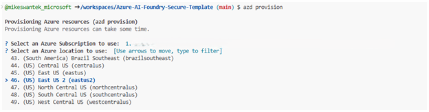

# Required Roles and Scopes for AI Foundry isolated network template deployment
To deploy this code, assign roles with minimal privileges to create and manage necessary Azure resources. Ensure roles are assigned at the appropriate subscription or resource group levels.

## Role Assignments: 
- Contributor role should be assigned at the subscription level to ensure the user has permission to create resource groups and manage resources.
- User Access Administrator Role: Since this deployment sets various role scopes, the User Access Administrator is required.

A user with the Contributor role at the subscription level should have sufficient permissions to deploy the provided Bicep template. The Contributor role allows the user to create and manage all types of Azure resources, including resource groups, virtual networks, storage accounts, virtual machines, and other resources defined in the Bicep template.

# Pre-deployment steps:

Be sure these resource providers are registered in your Azure subscription. To register a resource provider in Azure, you need to have the Contributor role at the subscription level or higher. If you only have contributor permissions at the resource or resource group scope, you may need to reach out to the service owner to perform this task at the subscription level.

| **Resource Type** | **Azure Resource Provider** | **Type** | **Description** |
|-------------------|----------------------------|----------|-----------------|
| Application Insights | Microsoft.Insights | /components | An Azure Application Insights instance associated with the Azure AI Foundry Hub |
|Azure Log Analytics|Microsoft.OperationalInsights|/workspaces|An Azure Log Analytics workspace used to collect diagnostics|
|Azure Key Vault|Microsoft.KeyVault|/vaults|An Azure Key Vault instance associated with the Azure AI Foundry Hub|
|Azure Storage Account|Microsoft.Storage|/storageAccounts|An Azure Storage instance associated with the Azure AI Foundry Hub|
|Azure Container Registry|Microsoft.ContainerRegistry|/registries|An Azure Container Registry instance associated with the Azure AI Foundry Hub|
|Azure AI Hub / Project|Microsoft.MachineLearningServices|/workspaces|An Azure AI Studio Hub and Project (Azure ML Workspace of kind ‘hub’ and ‘project’)|
|Azure AI Services|Microsoft.CognitiveServices|/accounts|An Azure AI Services as the model-as-a-service endpoint provider including GPT-4o and ADA Text Embeddings model deployments|
|Azure Virtual Network|Microsoft.Network|/virtualNetworks|A bring-your-own (BYO) virtual network hosting a virtual machine to connect to Azure AI Foundry which will be behind a private endpoint when in network isolation mode. |
|Bastion Host|Microsoft.Network||A Bastion Host defined in the BYO virtual network that provides RDP connectivity to the jumpbox virtual machine|
|Azure NAT Gateway|Microsoft.Network|/natGateways|An Azure NAT Gateway that provides outbound connectivity to the jumpbox virtual machine|
|Azure Private Endpoints|Microsoft.Network|/privateEndpoints|Azure Private Endpoints defined in the BYO virtual network for Azure Container Registry, Azure Key Vault, Azure Storage Account, and Azure AI Foundry Hub/Project|
|Azure Private DNS Zones|Microsoft.Network|/privateDnsZones|Azure Private DNS Zones are used for the DNS resolution of the Azure Private Endpoints|

# Provision Network Isolated environment
1. Navigate to the repo
1. Click the code button
1. Click the Codespaces tab
1. Click "Create Codespaces on main" 

This step will create the codespaces environment for you and launch a web based VS Code session.
1. In the terminal window (usually below by default) you can select the layout of the window in the upper right corner.

1. Log into your Azure subscription by leveraging the “azd auth login” command. Type the command “azd auth login”.  It will display a code to copy and paste into the authorization window that will appear when you hit the enter button.

**Prompting for MFA**

1. Return to the codespaces window now. In the terminal window, begin by initializing the environment by tying the command “azd init”

1. Enter the name for your environment

1. Now start the deployment of the infrastructure by typing the command “azd provision” 

This step will allow you to chose from the subscriptions you have available, based on the account you logged in with in the azd auth login step. Next it will prompt you for the region to deploy the resources into.

1. The provisioning of resources will run and deploy the Network Isolated AI Foundry Hub, Project and dependent resources in about 20 minutes. 

# Post Deployment Steps:
