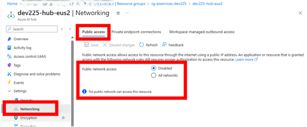
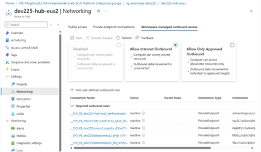
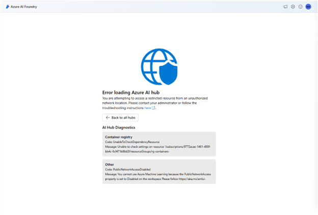
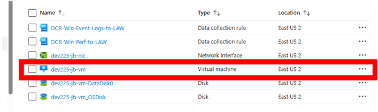
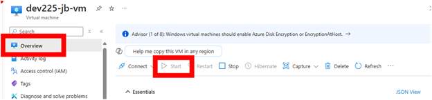
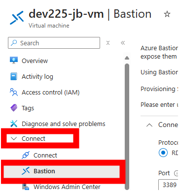
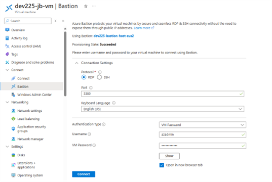
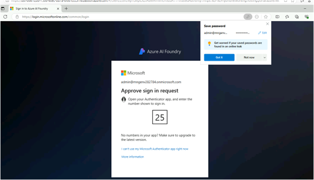
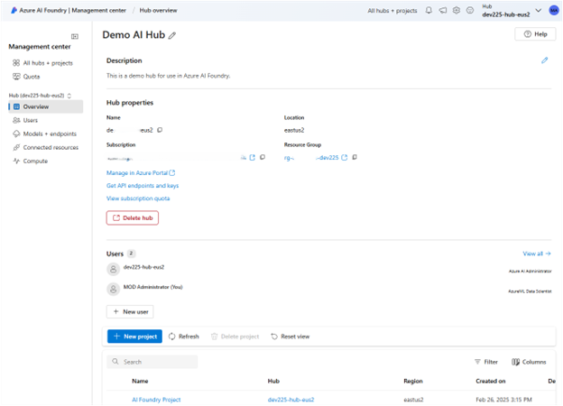

# Post Deployment Steps

After running `azd up` or `azd provision` followed by `azd hooks run postprovision`, use these steps to verify that all components were deployed correctly and are functioning as expected.

---

## Quick Verification Checklist

| Component | How to Verify | Expected State |
|-----------|---------------|----------------|
| Fabric Capacity | Azure Portal → Microsoft Fabric capacities | **Active** (not Paused) |
| Fabric Workspace | [app.fabric.microsoft.com](https://app.fabric.microsoft.com) | Workspace visible with 3 lakehouses |
| Microsoft Foundry project | [ai.azure.com](https://ai.azure.com) | Project accessible, models deployed |
| AI Search Index | Azure Portal → AI Search → Indexes | `onelake-index` exists with documents |
| Purview Scan | Purview Portal → Data Map → Sources | Fabric data source registered |

---

## 1. Verify Fabric Capacity is Active

The Fabric capacity must be in **Active** state for the workspace and lakehouses to function.

1. Navigate to **Azure Portal** → **Microsoft Fabric capacities**
2. Select your capacity (e.g., `fabricdev<envname>`)
3. Verify the **State** shows **Active**

If the capacity is **Paused**:
```bash
# Resume via Azure CLI
az fabric capacity resume --capacity-name <capacity-name> --resource-group <rg-name>
```

> **Cost Note:** Fabric capacities incur charges while Active. The capacity can be paused when not in use to reduce costs.

---

## 2. Verify Fabric Workspace and Lakehouses

1. Navigate to [app.fabric.microsoft.com](https://app.fabric.microsoft.com)
2. Sign in with your Azure credentials
3. Select the workspace created by the deployment (e.g., `workspace-<envname>`)
4. Verify the following lakehouses exist:
   - **bronze** — Raw ingested documents
   - **silver** — Processed/transformed data
   - **gold** — Curated analytics-ready data

5. Open the **bronze** lakehouse and verify the `Files/documents` folder structure exists
6. In the workspace, check each lakehouse (**bronze**, **silver**, **gold**) and confirm the **Sensitivity label** matches the value set in the parameter file.

### Optional PostgreSQL Mirroring Follow-Up

End-to-end mirroring is not part of `azd up` or post-provisioning. Some steps are manual.

For the full steps (including the Fabric portal **New item** mirror), follow [PostgreSQL mirroring](./postgresql_mirroring.md).

---

## 3. Verify Microsoft Foundry Project

1. Navigate to [ai.azure.com](https://ai.azure.com)
2. Sign in and select your Microsoft Foundry project
3. Verify:
   - **Models** — Check that GPT-4o and text-embedding-ada-002 (or configured models) are deployed
   - **Connections** — AI Search connection should be listed
   - **Playground** — Test the chat playground with a sample query

### Testing AI Search Connection in Playground

1. In Microsoft Foundry, go to **Playgrounds** → **Chat**
2. Click **Add your data**
3. Select your AI Search index (`onelake-index`)
4. Ask a question about your indexed documents

If the connection fails, verify RBAC roles are assigned (see Troubleshooting section).

---

## 4. Verify AI Search Index

1. Navigate to **Azure Portal** → **AI Search** → your search service
2. Go to **Indexes** and verify `onelake-index` exists
3. Check the **Document count** — should be > 0 if documents were uploaded to the bronze lakehouse
4. Go to **Indexers** and verify `onelake-indexer` shows:
   - **Status**: Success
   - **Last run**: Recent timestamp

> **Note:** Uploading new files to the bronze lakehouse does not auto-trigger the indexer. Re-run it manually after uploads:

```bash
az search indexer run --name onelake-indexer --service-name <search-name> --resource-group <rg>
```

### Test the Index

Re-index after uploads if you do not see new documents:

```bash
az search indexer run --name onelake-indexer --service-name <search-name> --resource-group <rg>
```

1. In the Search service, go to **Search explorer**
2. Run a simple query: `*`
3. Verify documents are returned

If no documents appear, check:
- Documents exist in `bronze/Files/documents/`
- Indexer has run successfully (check indexer execution history)

---

## 5. Verify Purview Integration (if enabled)

1. Navigate to the **Microsoft Purview governance portal**
2. Go to **Data Map** → **Sources**
3. Verify the Fabric data source is registered (e.g., `Fabric-Workspace-<id>`)
4. Check **Scans** to see if the initial scan completed

If `purviewCollectionName` is left empty in [infra/main.bicepparam](../infra/main.bicepparam), the automation now uses `collection-<AZURE_ENV_NAME>`.

If you need to rerun the Purview steps after provisioning:

```powershell
pwsh ./scripts/automationScripts/FabricPurviewAutomation/create_purview_collection.ps1
pwsh ./scripts/automationScripts/FabricWorkspace/CreateWorkspace/register_fabric_datasource.ps1
pwsh ./scripts/automationScripts/FabricPurviewAutomation/trigger_purview_scan_for_fabric_workspace.ps1
```

### Data Lineage (Optional)

Lineage appears only after you run data movement or transformation jobs (for example, copying data from bronze to silver). If you have not moved data yet, skip lineage verification.

---

## 6. Verify Network Isolation (if enabled)

When `networkIsolation` is set to `true`:

### Check Microsoft Foundry Network Settings

1. Go to **Azure Portal** → **Microsoft Foundry** → your account
2. Click **Settings** → **Networking**
3. Verify:
   - **Public network access**: Disabled (if fully isolated)
   - **Private endpoints**: Active connections listed

   

4. Open the **Workspace managed outbound access** tab to see private endpoints

   

### Test Isolation

When accessing Microsoft Foundry from outside the virtual network, you should see an access denied message:



This is **expected behavior** — the resources are only accessible from within the virtual network.

---

## 7. Connecting via Bastion (Network Isolated Deployments)

For network-isolated deployments, use Azure Bastion to access resources:

1. Navigate to **Azure Portal** → your resource group → **Virtual Machine**

   

2. Ensure the VM is **Running** (start it if stopped)

   

3. Select **Bastion** under the **Connect** menu

   

4. Enter the VM admin credentials (set during deployment) and click **Connect**

   

5. Once connected, open **Edge browser** and navigate to:
   - [ai.azure.com](https://ai.azure.com) — Microsoft Foundry
   - [app.fabric.microsoft.com](https://app.fabric.microsoft.com) — Fabric

6. Complete MFA if prompted

   

7. You should now have full access to the isolated resources

   

---

## Troubleshooting

### Fabric Capacity Shows "Paused"

```bash
# Check capacity state
az resource show --ids /subscriptions/<sub>/resourceGroups/<rg>/providers/Microsoft.Fabric/capacities/<name> --query properties.state

# Resume capacity
az fabric capacity resume --capacity-name <name> --resource-group <rg>
```

### AI Search Connection Fails in Microsoft Foundry Playground

Verify RBAC roles are assigned to the Microsoft Foundry identities:

```bash
# Get the AI Search resource ID
SEARCH_ID=$(az search service show --name <search-name> --resource-group <rg> --query id -o tsv)

# Check role assignments
az role assignment list --scope $SEARCH_ID --output table
```

Required roles on the AI Search service:
- **Search Service Contributor** — For the Microsoft Foundry account and project managed identities
- **Search Index Data Contributor** — For read/write access to index data
- **Search Index Data Reader** — For read access to index data

If roles are missing, re-run the RBAC setup:
```bash
eval $(azd env get-values)
pwsh ./scripts/automationScripts/OneLakeIndex/06_setup_ai_foundry_search_rbac.ps1
```

### Indexer Shows No Documents

1. Verify documents exist in the bronze lakehouse:
   - Go to Fabric → bronze lakehouse → Files → documents
   
2. Check indexer status:
   - Azure Portal → AI Search → Indexers → `onelake-indexer`
   - Review execution history for errors

3. Manually trigger indexer:
   ```bash
   az search indexer run --name onelake-indexer --service-name <search-name> --resource-group <rg>
   ```

### Purview Scan Failed

1. Verify Purview has Fabric workspace access:
   - The Purview managed identity needs **Contributor** role on the Fabric workspace
   
2. Check scan configuration:
   - Purview Portal → Data Map → Sources → Fabric source → Scans

3. Re-run the registration script:
   ```bash
   eval $(azd env get-values)
   pwsh ./scripts/automationScripts/FabricWorkspace/CreateWorkspace/register_fabric_datasource.ps1
   ```

### Post-Provision Hooks Failed

To re-run all post-provision hooks:
```bash
azd hooks run postprovision
```

To run a specific script:
```bash
eval $(azd env get-values)
pwsh ./scripts/automationScripts/<path-to-script>.ps1
```

---

## Next Steps

Once verification is complete:

1. **Upload documents** to the bronze lakehouse for indexing
2. **Test the Microsoft Foundry playground** with your indexed content
3. **Configure additional models** if needed
4. **[Deploy your app](./deploy_app_from_foundry.md)** from the Microsoft Foundry playground
5. **Review governance** in Microsoft Purview
