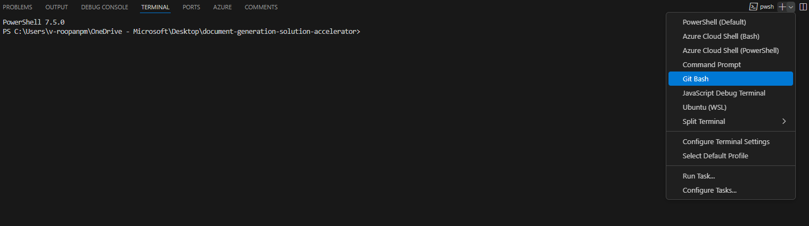

# Check Quota Availability Before Deployment

Before deploying the accelerator, **ensure sufficient quota availability** for the required AI models and Fabric capacity.
> **The default capacities match the deployment parameters in `infra/main.bicepparam`.**

## Login if you have not done so already
```
az login
```

## 📌 Default Models & Capacities:
These match the `modelDeploymentList` in the Bicep parameters:
```
gpt-4.1-mini:40:GlobalStandard, text-embedding-3-large:40:Standard
```

## 📌 Default Regions:
```
eastus, eastus2, swedencentral, uksouth, westus, westus2, southcentralus, canadacentral, australiaeast, japaneast, norwayeast
```

## 📌 Optional: Fabric Capacity Check
The accelerator also deploys a **Microsoft Fabric F8** capacity. Pass `--check-fabric` (bash) or `-CheckFabric` (PowerShell) to verify Fabric SKU availability.

## Usage Scenarios:
- No parameters passed → Default models and capacities will be checked in default regions.
- Only model(s) provided → The script will check for those models in the default regions.
- Only region(s) provided → The script will check default models in the specified regions.
- Both models and regions provided → The script will check those models in the specified regions.
- `--verbose` passed → Enables detailed logging output for debugging and traceability.
- `--check-fabric` passed → Also checks Microsoft Fabric capacity availability.
  
## **Input Formats — Bash**
> Use the --models, --regions, --verbose, and --check-fabric options for parameter handling:

✔️ Run without parameters to check default models & regions:
   ```sh
   ./quota_check.sh
   ```
✔️ Enable verbose logging:
   ```sh
   ./quota_check.sh --verbose
   ```
✔️ Check specific model(s) in default regions:
  ```sh
  ./quota_check.sh --models gpt-4.1-mini:40:GlobalStandard,text-embedding-3-large:40:Standard
  ```
✔️ Check default models in specific region(s):
  ```sh
  ./quota_check.sh --regions eastus,westus
  ```
✔️ All parameters combined:
  ```sh
  ./quota_check.sh --models gpt-4.1-mini:40 --regions eastus,westus --verbose
  ```
✔️ Also check Fabric capacity availability:
  ```sh
  ./quota_check.sh --check-fabric --verbose
  ```

## **Input Formats — PowerShell**
> Use the -Models, -Regions, -Verbose, and -CheckFabric parameters:

✔️ Run without parameters:
   ```powershell
   .\quota_check.ps1
   ```
✔️ Check specific model(s):
  ```powershell
  .\quota_check.ps1 -Models "gpt-4.1-mini:40:GlobalStandard,text-embedding-3-large:40:Standard"
  ```
✔️ Check specific region(s):
  ```powershell
  .\quota_check.ps1 -Regions "eastus,westus2"
  ```
✔️ All parameters combined:
  ```powershell
  .\quota_check.ps1 -Models "gpt-4.1-mini:40" -Regions "eastus,westus" -CheckFabric -Verbose
  ```

## **Sample Output**
The final table lists regions with available quota. You can select any of these regions for deployment.

```
╔══════════════════════════════════════════════════════════════╗
║                     QUOTA CHECK SUMMARY                    ║
╚══════════════════════════════════════════════════════════════╝

Region                gpt-4.1-mini                  text-embedding-3-large        Status
──────────────────────────────────────────────────────────────────────────────────────────
eastus                ✅ 200/240 (need 40)           ✅ 120/200 (need 40)           ✅ PASS
eastus2               ❌ 10/240 (need 40)            ✅ 50/200 (need 40)            ❌ FAIL
swedencentral         ✅ 100/240 (need 40)           ✅ 80/200 (need 40)            ✅ PASS
```

---
## **If using Azure Portal and Cloud Shell**

1. Navigate to the [Azure Portal](https://portal.azure.com).
2. Click on **Azure Cloud Shell** in the top right navigation menu.
3. Run the appropriate command based on your requirement:  

   **To check quota for the deployment**  

    ```sh
    curl -L -o quota_check.sh "https://raw.githubusercontent.com/microsoft/Deploy-Your-AI-Application-In-Production/main/scripts/quota_check.sh"
    chmod +x quota_check.sh
    ./quota_check.sh
    ```
    - Refer to [Input Formats — Bash](#input-formats--bash) for detailed commands.
      
## **If using VS Code or Codespaces**

### Option 1: Bash (Linux, macOS, Git Bash, WSL, Cloud Shell)
1. Open the terminal in VS Code or Codespaces.
2. Use a terminal that can run bash.
  
3. Navigate to the `scripts` folder and make the script executable:
   ```sh
    cd scripts
    chmod +x quota_check.sh
    ```
4. Run the script:
    ```sh
    ./quota_check.sh
    ```
   - Refer to [Input Formats — Bash](#input-formats--bash) for detailed commands.

### Option 2: PowerShell (Windows, Linux, macOS)
1. Open a PowerShell terminal in VS Code.
2. Navigate to the `scripts` folder:
   ```powershell
   cd scripts
   ```
3. Run the script:
   ```powershell
   .\quota_check.ps1
   ```
   - Refer to [Input Formats — PowerShell](#input-formats--powershell) for detailed commands.