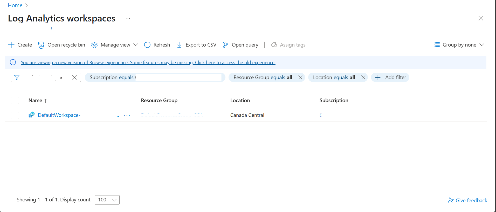
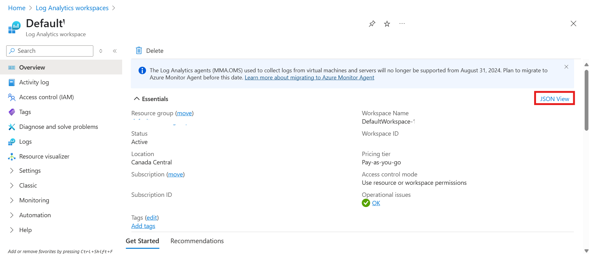
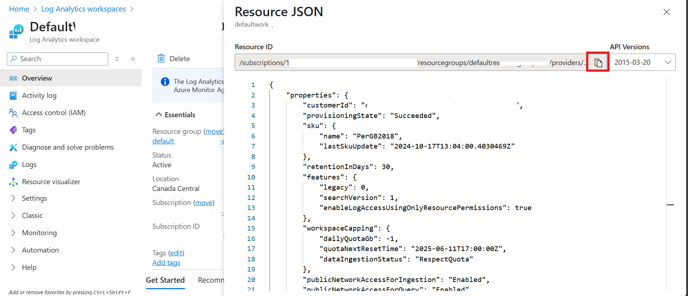

[← Back to *DEPLOYMENT* guide](/docs/deploymentguide.md#deployment-steps)

# Reusing an Existing Log Analytics Workspace

To configure your environment to use an existing Log Analytics Workspace, follow these steps:

---

### 1. Go to Azure Portal

Go to https://portal.azure.com

### 2. Search for Log Analytics

In the search bar at the top, type "Log Analytics workspaces" and click on it, then click on the workspace you want to use.



### 3. Copy Resource ID

In the **Overview** pane, click on **JSON View**.



Copy the **Resource ID** that is your Workspace ID.



### 4. Set the Workspace ID in Your Environment

Run the following command in your terminal:

```bash
azd env set EXISTING_LOG_ANALYTICS_WORKSPACE_RESOURCE_ID '<Existing Log Analytics Workspace Resource ID>'
```

Replace `<Existing Log Analytics Workspace Resource ID>` with the value obtained from Step 3.

### 5. Continue Deployment

Proceed with the next steps in the [deployment guide](/docs/deploymentguide.md#deployment-steps).

---

[← Back to *DEPLOYMENT* guide](/docs/deploymentguide.md#deployment-steps)
