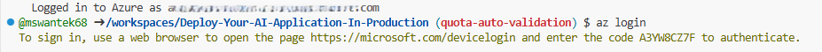

### VS Code Web

You can run this solution using VS Code Web. The button will open a web-based VS Code instance in your browser:

1. Open the project:

    [&message=Open&color=blue&logo=visualstudiocode&logoColor=white)](https://insiders.vscode.dev/azure/?vscode-azure-exp=foundry&agentPayload=eyJiYXNlVXJsIjogImh0dHBzOi8vcmF3LmdpdGh1YnVzZXJjb250ZW50LmNvbS9taWNyb3NvZnQvRGVwbG95LVlvdXItQUktQXBwbGljYXRpb24tSW4tUHJvZHVjdGlvbi9yZWZzL2hlYWRzL21haW4vaW5mcmEvdnNjb2RlX3dlYiIsICJpbmRleFVybCI6ICIvaW5kZXguanNvbiIsICJ2YXJpYWJsZXMiOiB7ImFnZW50SWQiOiAiIiwgImNvbm5lY3Rpb25TdHJpbmciOiAiIiwgInRocmVhZElkIjogIiIsICJ1c2VyTWVzc2FnZSI6ICIiLCAicGxheWdyb3VuZE5hbWUiOiAiIiwgImxvY2F0aW9uIjogIiIsICJzdWJzY3JpcHRpb25JZCI6ICIiLCAicmVzb3VyY2VJZCI6ICIiLCAicHJvamVjdFJlc291cmNlSWQiOiAiIiwgImVuZHBvaW50IjogIiJ9LCAiY29kZVJvdXRlIjogWyJhaS1wcm9qZWN0cy1zZGsiLCAicHl0aG9uIiwgImRlZmF1bHQtYXp1cmUtYXV0aCIsICJlbmRwb2ludCJdfQ==)

3. VS Code Web window will open (may take a few minutes to load), Sign in with your Azure account when prompted.
4. Select the subscription where you want to deploy the solution
5. Wait for the environment to initialize (includes all deployment tools)
6. Once the solution opens, the **AI Foundry terminal** will automatically start running the following command to install the required dependencies:

    ```shell
    sh install.sh
    ```
    During this process, you’ll be prompted with the message:
    ```
    What would you like to do with these files?
    - Overwrite with versions from template
    - Keep my existing files unchanged
    ```
    Choose “**Overwrite with versions from template**” and provide a unique environment name when prompted.
5. Continue with the [deploying steps](#steps-to-provision-network-isolated-environment-using-dev-container).

# Steps to Provision Network Isolated environment using Dev Container

1. Log into your Azure subscription:

   ```shell
    azd auth login
    ```

   

   

   

2. Login to azure, run the below command: 
    ```shell
    az login --use-device-code
     ```
    The [Azure CLI](https://learn.microsoft.com/en-us/cli/azure/what-is-azure-cli?view=azure-cli-latest) is used by scripts that run during deployment. This will prompt you to select a subscription. Please select the appropriate subscription.

     

3. Now start the deployment of the infrastructure by typing the below command:
    ```shell
    azd up
    ```
    > ⚠️ **Note:** The latest version of the Azure Developer CLI (AZD) is currently limited on prompting for missing parameters. The feature flag parameters in this solution have been temporarily defaulted to `'disabled'` until this limitation is lifted and prompting will resume.
   

   
   
   It will prompt you for the region to deploy the resources into as well as any additional Azure resources to be provisioned and configured.

    **Important:** Be sure to remember the vm password. This will be used in a later step. You are still required to log into Azure once you connect through the virtual machine.
    > ⚠️ **Note:**  
    > 1. For **WAF Deployment**, Select the **Network Isolation** as **'True'**.  
    >   
    > 2. For **Sample App Deployment**, Select the **appSampleEnabled** as **'True'**.  
    > 

4. After completeing the required paramters that you were prompted for, the provisioning of resources will run and deploy the Network Isolated AI Foundry development portal and dependent resources in about 20-30 minutes.


# Post Deployment Steps:
These steps will help to check that the isolated environment was set up correctly.
Follow these steps to check the creation of the required private endpoints in the environment (when set to networkIsolation = true).

One way to verify whether access is private to the foundry is by launching Azure AI Foundry from the portal.


When a user that is not connected through the virtual network via an RDP approved connection will see the following screen in their browser. This is the intended behavior! 


A more thourough check is to look for the networking settings and checking for private end points.

1. Go to the Azure Portal and select your Azure AI hub that was just created.

2.	Click on Resource Management and then Networking.

    


    Here, you will find the private endpoints that are connected to the resources within the foundry managed virtual network. Ensure that these private endpoints are active.
    The foundry should show that Public access is ‘disabled’.

## Connecting to the isolated network via RDP
1.	Navigate to the resource group where the isolated AI Foundry was deployed to and select the virtual machine.

    

2.	Be sure that the Virtual Machine is running. If not, start the VM.

    

3.	Select “Bastion” under the ‘Connect’ heading in the VM resource.

    

4.	Supply the username and the password you created as environment variables and press the connect button.

    

5.	Your virtual machine will launch and you will see a different screen.

    

6.	Launch Edge browser and navigate to your Azure AI Foundry. https://ai.azure.com Sign in using your credentials.


7.	You are challenged by MFA to connect.

    

8.	You will now be able to view the Azure AI Foundry which is contained in an isolated network.

    

## Contributing

This project welcomes contributions and suggestions. Most contributions require you to agree to a
Contributor License Agreement (CLA) declaring that you have the right to, and actually do, grant us
the rights to use your contribution. For details, visit https://cla.opensource.microsoft.com.

When you submit a pull request, a CLA bot will automatically determine whether you need to provide
a CLA and decorate the PR appropriately (e.g., status check, comment). Simply follow the instructions
provided by the bot. You will only need to do this once across all repos using our CLA.

This project has adopted the [Microsoft Open Source Code of Conduct](https://opensource.microsoft.com/codeofconduct/).
For more information see the [Code of Conduct FAQ](https://opensource.microsoft.com/codeofconduct/faq/) or
contact [opencode@microsoft.com](mailto:opencode@microsoft.com) with any additional questions or comments.

## Trademarks

This project may contain trademarks or logos for projects, products, or services. Authorized use of Microsoft 
trademarks or logos is subject to and must follow 
[Microsoft's Trademark & Brand Guidelines](https://www.microsoft.com/en-us/legal/intellectualproperty/trademarks/usage/general).
Use of Microsoft trademarks or logos in modified versions of this project must not cause confusion or imply Microsoft sponsorship.
Any use of third-party trademarks or logos are subject to those third-party's policies.
